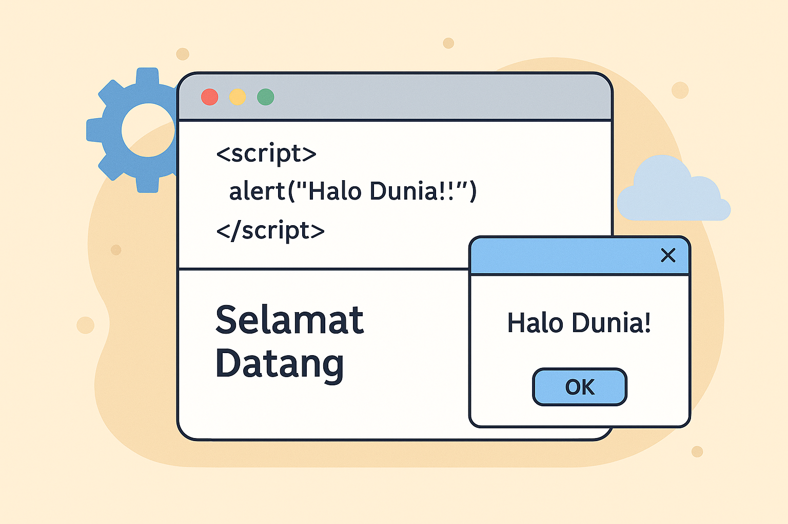
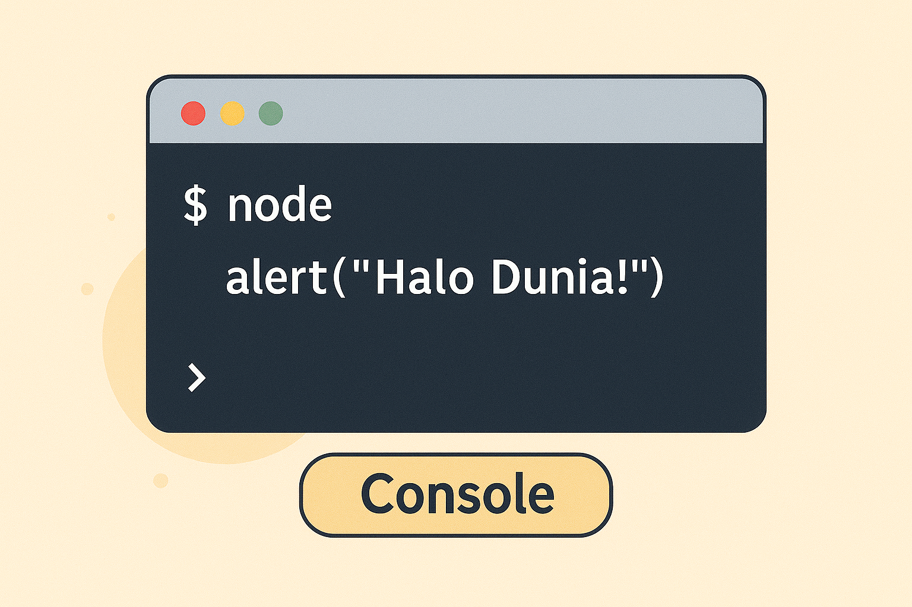

## Pendahuluan  

Bayangkan seseorang membuka halaman web sederhana berisi teks “Selamat Datang”. Awalnya, halaman itu terasa statis, hanya menyajikan informasi seperti papan pengumuman. Namun begitu ia menambahkan satu baris kode `alert("Halo Dunia!")` di dalam tag `<script>`, tiba-tiba layar menampilkan kotak pesan interaktif. Dari pengalaman kecil itu, muncul perasaan ajaib: ternyata satu baris instruksi mampu mengubah halaman biasa menjadi sesuatu yang hidup.  

Inilah titik awal mengapa banyak pemula jatuh cinta pada JavaScript. Browser, yang sehari-hari digunakan hanya untuk berselancar internet, berubah fungsi menjadi laboratorium eksperimen. Di sana, setiap ide dapat diuji dengan cepat tanpa harus menyiapkan alat tambahan. Cukup buka *developer tools*, masuk ke tab Console, lalu tuliskan `console.log("Belajar JS di Browser")`, hasilnya langsung terlihat seketika. Respon instan ini membuat proses belajar terasa menyenangkan sekaligus memotivasi untuk mencoba hal-hal baru.  

Seiring waktu, orang mulai memahami bahwa JavaScript adalah jembatan antara halaman statis dan interaksi dinamis. Tanpa JavaScript, web hanyalah kumpulan teks dan gambar yang diam. Tetapi begitu kode ditambahkan, halaman bisa merespons klik, mengubah warna, bahkan menampilkan data secara real-time. Pengalaman menjalankan JavaScript di browser bukan hanya latihan teknis, melainkan pintu masuk menuju dunia pemrograman web yang penuh kemungkinan.  

  

---

## Konsep Dasar  

Konsep utama dalam menjalankan JavaScript di browser adalah integrasi antara HTML sebagai struktur halaman dan JavaScript sebagai logika dinamis. JavaScript dijalankan melalui elemen `<script>` yang dapat ditulis langsung di dalam file HTML (inline) atau dipisahkan ke dalam file eksternal dengan ekstensi `.js`. Browser membaca file HTML dari atas ke bawah, lalu mengeksekusi kode JavaScript sesuai urutan letaknya. Dengan memahami alur ini, developer dapat mengontrol kapan dan bagaimana script dijalankan.  

Terdapat dua cara umum dalam menyematkan JavaScript, yaitu script inline dan script eksternal. Script inline berarti kode ditulis langsung di dalam tag `<script>` pada file HTML, biasanya digunakan untuk percobaan sederhana. Sedangkan script eksternal menggunakan atribut `src` untuk memanggil file JavaScript terpisah, cara ini lebih direkomendasikan agar kode lebih rapi dan mudah dirawat【33†source】. Dalam praktik modern, developer biasanya menempatkan tag `<script>` di akhir elemen `<body>` agar seluruh elemen HTML sudah dimuat sebelum kode JavaScript dijalankan.  

Selain penyematan di HTML, browser juga menyediakan *developer tools* sebagai ruang eksekusi cepat. Tab Console pada developer tools memungkinkan kita mengetikkan kode JavaScript secara langsung dan melihat hasilnya segera. Hal ini sangat berguna untuk debugging maupun eksperimen kecil sebelum kode dimasukkan ke dalam file proyek【33†source】. Dengan begitu, Console berfungsi sebagai jendela interaktif untuk memahami perilaku bahasa JavaScript.  

> **Info penting:** Menempatkan kode JavaScript di luar file HTML (eksternal) membantu memisahkan struktur, tampilan, dan logika program. Pendekatan ini mendukung prinsip *separation of concerns* yang penting untuk pengembangan aplikasi skala besar.  

  

---

## Panduan Langkah per Langkah  

Langkah pertama untuk menjalankan JavaScript di browser adalah membuat file HTML dasar. File ini biasanya diberi nama `index.html` dan berisi struktur minimal berupa deklarasi `<!DOCTYPE html>`, elemen `<head>`, serta elemen `<body>`. Di dalam `<body>`, kita bisa menyisipkan tag `<script>` untuk menuliskan JavaScript secara langsung. Contoh sederhana adalah menulis perintah untuk menampilkan pesan pop-up saat halaman dibuka. File HTML ini dapat dijalankan dengan klik ganda sehingga terbuka di browser seperti Chrome, Firefox, atau Edge. Proses ini memberikan pengalaman awal bagaimana kode JavaScript bereaksi terhadap halaman web. Praktik sederhana ini menekankan integrasi dasar antara HTML dan JavaScript yang sangat penting untuk dipahami pemula.  

```html
<!DOCTYPE html>
<html>
<head>
  <title>Belajar JavaScript</title>
</head>
<body>
  <h1>Halo JavaScript</h1>
  <script>
    alert("Halo Dunia!");
  </script>
</body>
</html>
```  

Langkah berikutnya adalah membuat file eksternal JavaScript untuk memisahkan logika dari struktur halaman. Misalnya, buat file baru bernama `script.js` yang berisi instruksi sederhana untuk menampilkan teks di Console. Setelah itu, hubungkan file eksternal tersebut ke dalam HTML dengan menambahkan atribut `src` pada tag `<script>`. Saat file HTML dijalankan di browser, hasil dari `console.log` akan muncul di tab Console pada developer tools. Pendekatan ini lebih direkomendasikan karena membuat kode lebih bersih dan mudah dipelihara pada proyek berskala besar. Dengan cara ini, kita sudah menerapkan praktik pemisahan struktur (HTML) dan logika (JavaScript).  

```javascript
// file: script.js
console.log("JavaScript eksternal berhasil dijalankan!");
```  

```html
<!-- penyematan dalam file HTML -->
<script src="script.js"></script>
```  

Langkah terakhir adalah menggunakan Console di browser untuk menjalankan JavaScript secara langsung. Console dapat dibuka dengan menekan tombol **F12** atau menggunakan kombinasi Ctrl+Shift+I pada Windows/Linux, serta Command+Option+I pada Mac. Setelah terbuka, pilih tab Console dan ketikkan instruksi yang ingin diuji. Hasil keluaran langsung muncul di bawah baris perintah Console sehingga pengguna dapat memverifikasi kode dengan cepat. Cara ini sering dipakai untuk debugging, menguji potongan kecil kode, atau mencoba logika sederhana. Console juga menampilkan pesan error secara detail yang membantu proses perbaikan. Dengan langkah ini, belajar JavaScript menjadi lebih interaktif karena hasil percobaan dapat segera dilihat.  

```javascript
console.log("Menjalankan JS langsung di Console!");
```  

> **Tips:** Saat menggunakan Console, biasakan membaca detail error yang muncul agar dapat memperbaiki kode lebih cepat. Browser modern selalu menampilkan informasi error lengkap yang dapat dijadikan panduan untuk debugging【33†source】.  

  

---

## Kesalahan Umum  

Ketika pertama kali menjalankan JavaScript di browser, banyak pemula menghadapi kendala yang sebenarnya sederhana namun bisa menimbulkan kebingungan besar. Masalah ini sering kali muncul bukan karena logika program yang rumit, melainkan karena detail teknis yang terlewat. Misalnya, ada yang lupa menutup tag `<script>` sehingga seluruh halaman tidak ditampilkan dengan benar. Ada pula yang salah menuliskan path menuju file eksternal, membuat browser tidak menemukan sumber kode yang diperlukan. Kesalahan lain adalah menjalankan instruksi di Console tetapi lupa menekan Enter, sehingga hasil tidak pernah muncul. Semua kesalahan ini tampak kecil, namun bisa menghambat proses belajar jika tidak segera dipahami. Oleh karena itu, mengenali kesalahan umum sejak awal akan mempercepat adaptasi pemula dalam menggunakan JavaScript di browser.  

### Kesalahan 1: Lupa Menutup Tag `<script>`  

**Salah:**  
```html
<script>
  alert("Halo Dunia!")
<!-- Tag script tidak ditutup -->
```  

**Benar:**  
```html
<script>
  alert("Halo Dunia!");
</script>
```  

Kesalahan ini sering terjadi karena pemula beranggapan bahwa browser akan otomatis menutup tag yang tidak lengkap. Padahal, browser akan membaca seluruh kode setelah tag `<script>` sebagai bagian dari JavaScript sehingga struktur dokumen menjadi kacau. Akibatnya, elemen-elemen HTML lain tidak muncul dengan benar, bahkan dapat menyebabkan error tambahan. Dengan menutup tag `<script>` secara tepat, kode JavaScript akan dipisahkan dari struktur HTML sehingga keduanya dapat berfungsi sebagaimana mestinya. Langkah sederhana ini merupakan kebiasaan baik yang harus ditanamkan sejak awal. Disiplin dalam menutup tag juga mencerminkan praktik menulis kode yang rapi dan konsisten【33†source】.  

### Kesalahan 2: Path File Eksternal Salah  

**Salah:**  
```html
<script src="script.js"></script>
```
(*Padahal file `script.js` berada di folder `js/`*)  

**Benar:**  
```html
<script src="js/script.js"></script>
```  

Path yang salah adalah salah satu kesalahan paling umum ketika bekerja dengan file eksternal. Browser hanya bisa mengeksekusi file yang dapat diakses sesuai lokasi yang ditentukan pada atribut `src`. Jika path salah, file JavaScript tidak akan ditemukan, sehingga kode tidak pernah dijalankan. Masalah ini sering membuat pemula kebingungan karena halaman tetap muncul tanpa pesan yang jelas. Solusinya adalah selalu memeriksa struktur folder dan memastikan nama file ditulis dengan benar, termasuk huruf besar dan kecil. Selain itu, Console pada developer tools dapat membantu menampilkan pesan error untuk memverifikasi letak kesalahan. Dengan memperhatikan detail kecil ini, proses belajar menjadi lebih lancar dan efisien【33†source】.  

### Kesalahan 3: Tidak Mengeksekusi Kode di Console  

**Salah:**  
```javascript
console.log("Belajar JS di Console")
```
(*Ditulis di Console tetapi tidak menekan Enter*)  

**Benar:**  
```javascript
console.log("Belajar JS di Console");
```
(*Setelah Enter ditekan, hasil langsung muncul di bawah Console*)  

Kesalahan ini terjadi karena Console hanya akan mengeksekusi perintah setelah pengguna menekan Enter. Jika lupa, baris kode hanya ditampilkan tanpa menghasilkan output atau respon apa pun. Hal ini sering membuat pemula salah mengira bahwa JavaScript tidak bekerja dengan benar. Padahal, solusinya sederhana yaitu memastikan instruksi dikonfirmasi dengan Enter. Console sebenarnya merupakan alat yang sangat kuat untuk debugging, karena dapat menampilkan hasil eksekusi maupun error secara langsung. Dengan membiasakan diri menggunakan Console secara benar, developer dapat menguji potongan kode kecil sebelum menuliskannya di file utama. Kebiasaan ini akan melatih kecepatan dalam memahami alur logika JavaScript serta meningkatkan keterampilan debugging【33†source】.  

---

## Best Practice  

Menjalankan JavaScript di browser akan lebih efektif jika dibarengi dengan kebiasaan yang baik sejak awal. Praktik terbaik membantu menghindari kesalahan umum yang sering dialami pemula. Misalnya, menempatkan tag `<script>` pada lokasi yang tepat membuat halaman dimuat lebih cepat. Selain itu, memisahkan logika ke file eksternal memudahkan kolaborasi tim dan pemeliharaan jangka panjang. Menggunakan Console secara konsisten juga mempercepat proses debugging karena setiap error langsung terlihat. Dokumentasi sederhana melalui komentar dalam kode turut mendukung keterbacaan dan keberlanjutan proyek. Dengan membiasakan diri pada prinsip ini, belajar JavaScript menjadi lebih terstruktur dan profesional.  

### Praktik 1: Menempatkan Script di Akhir Body  

```html
<!DOCTYPE html>
<html>
<head>
  <title>Best Practice JS</title>
</head>
<body>
  <h1>Halo Dunia!</h1>
  <script src="script.js"></script>
</body>
</html>
```  

Menempatkan tag `<script>` di akhir body memastikan semua elemen HTML telah dimuat sebelum JavaScript dijalankan. Praktik ini menghindari error ketika JavaScript mencoba mengakses elemen yang belum tersedia di DOM. Selain itu, halaman akan terasa lebih cepat dimuat oleh pengguna karena struktur utama tampil lebih dulu【33†source】.  

### Praktik 2: Gunakan File Eksternal  

```javascript
// file: main.js
console.log("Kode eksternal lebih mudah dikelola");
```  

```html
<script src="main.js"></script>
```  

Memisahkan JavaScript ke file eksternal menjaga struktur kode tetap rapi dan memudahkan pemeliharaan. File eksternal juga bisa digunakan kembali di banyak halaman tanpa perlu duplikasi. Hal ini mendukung prinsip *reuse* dan *separation of concerns*, yang merupakan bagian penting dari pengembangan perangkat lunak modern【33†source】.  

### Praktik 3: Debugging dengan Console  

```javascript
console.log("Memulai aplikasi...");
console.log("Nilai variabel x:", x);
```  

Console adalah alat utama untuk memantau jalannya kode dan mendeteksi error sejak dini. Dengan menambahkan log, developer dapat melacak nilai variabel maupun alur eksekusi program. Teknik ini lebih baik dibandingkan hanya mengandalkan `alert()` yang mengganggu alur pengguna. Konsistensi dalam debugging membuat proses belajar lebih efisien dan terarah【33†source】.  

---

## Kesimpulan  

Menjalankan JavaScript di browser adalah fondasi penting dalam memahami interaksi antara kode dan halaman web. Melalui pendekatan yang sistematis, kita belajar bahwa JavaScript dapat ditulis langsung di dalam file HTML maupun dipisahkan ke file eksternal untuk pemeliharaan jangka panjang. Console pada browser menjadi sarana eksperimen cepat sekaligus alat debugging yang sangat efektif. Kesalahan umum seperti lupa menutup tag `<script>` atau salah menuliskan path file eksternal dapat dihindari dengan memperhatikan detail teknis. Praktik terbaik seperti menempatkan script di akhir body, memisahkan kode eksternal, dan menggunakan Console untuk debugging membantu meningkatkan kualitas pembelajaran. Dengan membiasakan prinsip ini, pemula dapat lebih percaya diri dalam mengembangkan kode JavaScript. Oleh karena itu, penguasaan cara menjalankan JavaScript di browser menjadi langkah awal yang menentukan keberhasilan dalam perjalanan belajar pemrograman web.  

---

## Referensi  

Flanagan, D. (2020). *JavaScript: The Definitive Guide*. O’Reilly Media.  
Haverbeke, M. (2018). *Eloquent JavaScript* (3rd ed.). No Starch Press.  
Mozilla Developer Network. (2022). *MDN Web Docs – JavaScript Guide*. Retrieved from https://developer.mozilla.org  
Crockford, D. (2008). *JavaScript: The Good Parts*. O’Reilly Media.  
Freeman, E., & Robson, E. (2014). *Head First JavaScript Programming*. O’Reilly Media.  
